# Program Features & Logic Explanation

---

## 1. Adding Student Data

Addition of Raw data to the file student_analyzer.js

### Code:
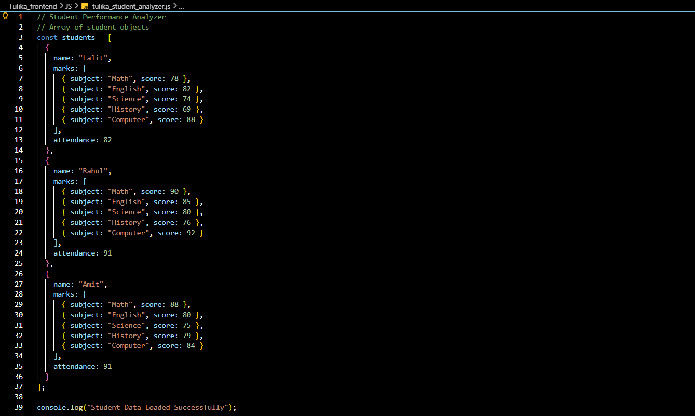

### Output:
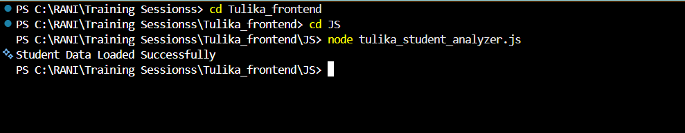

---
## 2. Total Marks Calculation

Each student's total marks are calculated by iterating through their subject scores using a loop and summing all values.

### Code:
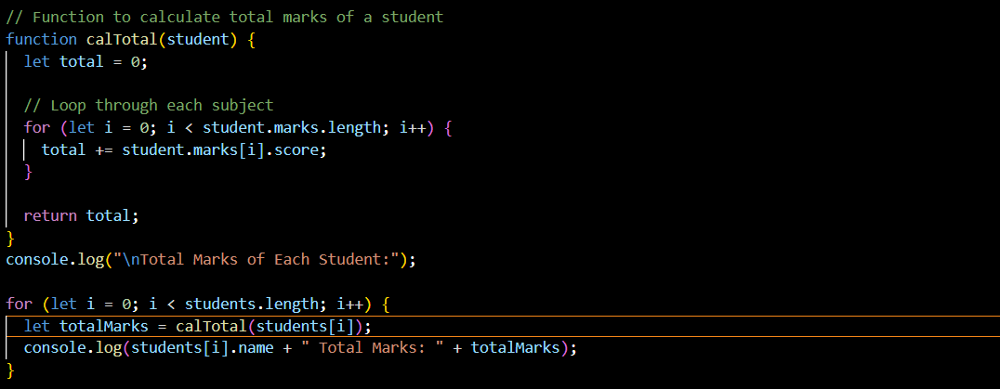

### Output:
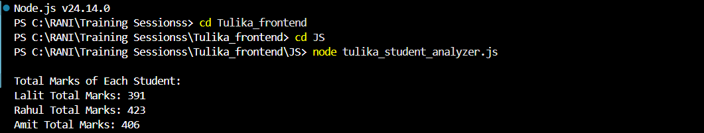

---

## 3. Average Marks Calculation

The average is calculated by dividing total marks by the number of subjects.
The `calTotal()` function is reused to maintain modularity and avoid repetition.

### Code:
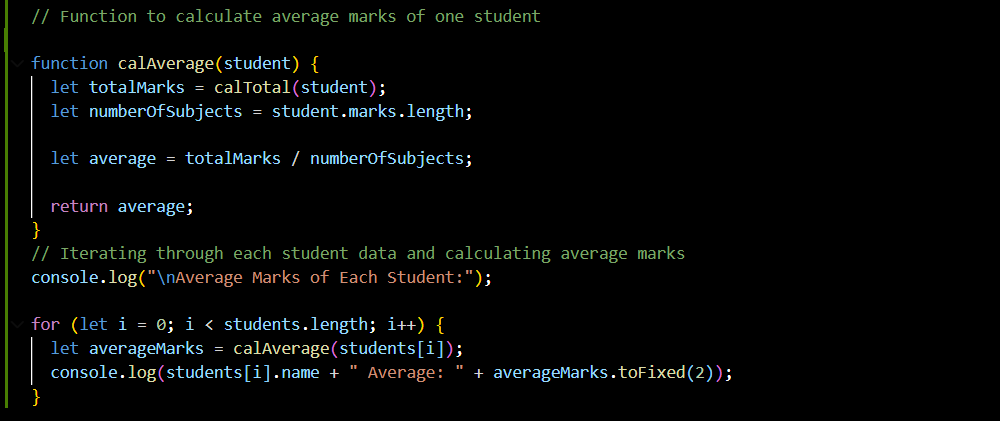

### Output:
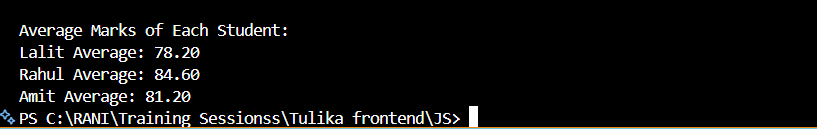

---

## 4. Subject-wise Highest Score

Nested loops are used:
- Outer loop → Subjects
- Inner loop → Students
This allows comparison of each subject score across all students to determine the highest scorer.

### Code:
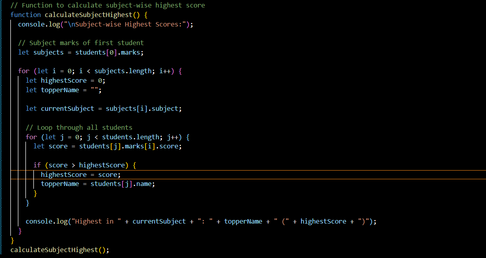

### Output:
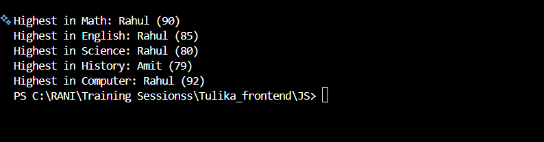

---

## 4️. Subject-wise Average Score

For each subject:
- Scores from all students are summed
- Divided by total number of students

### Code:
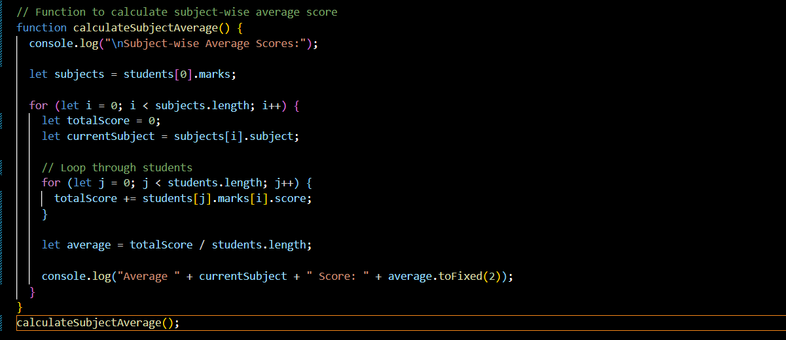

### Output:
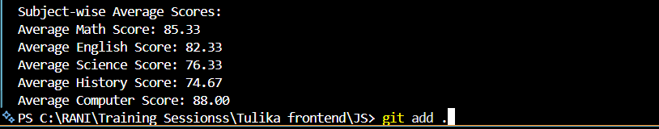

---

## 5️. Class Topper

The student with the highest total marks is determined using a single loop comparison.
This section displays the overall class topper along with total marks.

### Code:
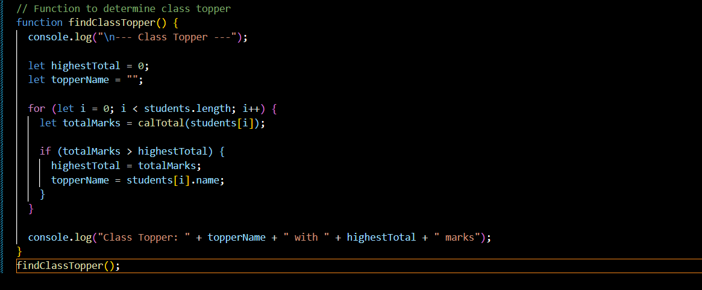

### Output:
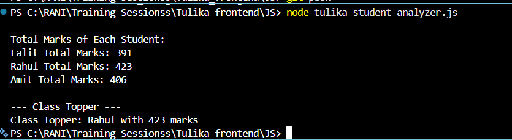

---

## 6️. Grade Assignment Logic

### Grade Rules:

| Average Marks | Grade |
|--------------|--------|
| 85 and above | A |
| 70–84 | B |
| 50–69 | C |
| Below 50 | Fail |

### Additional Fail Conditions:
- Attendance < 75%
- Any subject score ≤ 40

The fail conditions are checked before grade assignment to maintain correct logical order.

### Code:
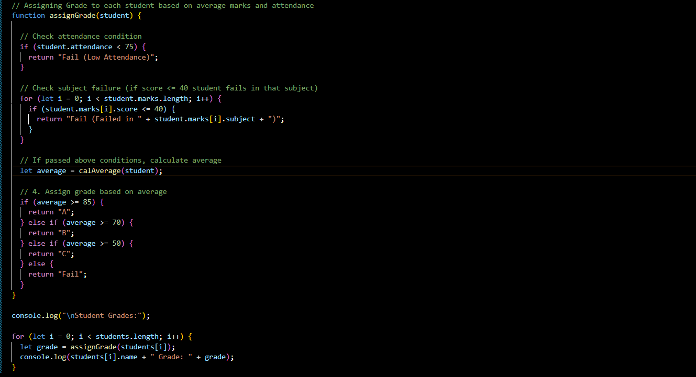

### Output:
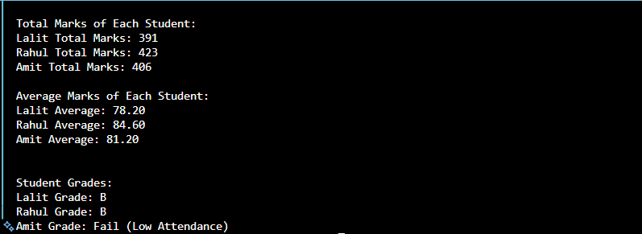

---
