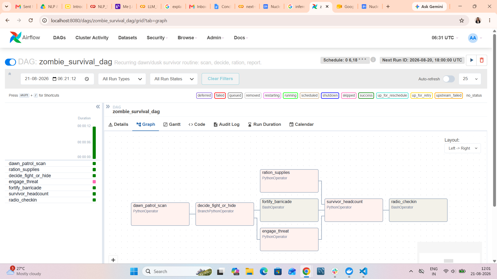
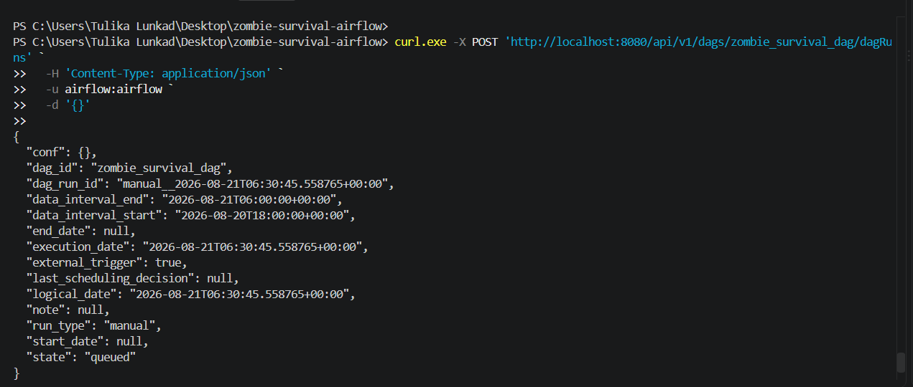

# Zombie Survival DAG

Apache Airflow pipeline that automates a survivor camp's dawn/dusk routine — scan the perimeter, decide fight or hide, ration supplies, and radio in a report — twice a day, on its own.

---

## Pipeline

```
dawn_patrol_scan ──▶ decide_fight_or_hide ──▶ engage_threat     ─┐
                                          └──▶ fortify_barricade ─┼──▶ survivor_headcount ──▶ radio_checkin
ration_supplies ─────────────────────────────────────────────────┘
```

| Task | Type | Purpose |
|---|---|---|
| `dawn_patrol_scan` | Python | Scans the perimeter, calculates a threat level (0–10) |
| `ration_supplies` | Python | Counts remaining supplies, runs in parallel |
| `decide_fight_or_hide` | Python (branch) | Routes to fight or hide based on threat level |
| `engage_threat` | Python | Fight-day only |
| `fortify_barricade` | Bash | Hide-day only |
| `survivor_headcount` | Python | Rejoins both branches, compiles the report |
| `radio_checkin` | Bash | Broadcasts the final situation report |

## Design Decisions

**XCom** — `threat_level` is calculated once in `dawn_patrol_scan` and passed downstream instead of being recomputed. It drives the branch decision, the `engage_threat` log, and the final report. `supply_count` and `headcount` get passed the same way so the report uses real numbers.

**Skip logic** — if the threat level is under 5, there's nothing to fight, so `engage_threat` gets skipped and `fortify_barricade` runs instead. Built with `BranchPythonOperator` so there's an actual alternate path, not just a task quietly skipped with nothing replacing it.

**Trigger rule** — `survivor_headcount` uses `none_failed_min_one_success`, since exactly one of its two upstream branches is always skipped by design. The default trigger rule would've skipped it too.

**Schedule** — `0 6,18 * * *`, 6 AM and 6 PM daily. Dawn is before scavenging runs start, dusk is before lockdown — a generic `@daily` doesn't reflect either of those moments.

## Screenshots

**Completed run, skipped task visible in the graph:**



**Triggered via the Airflow REST API (not the UI button):**



## Run It

```bash
# 1. Drop the DAG into your Airflow dags/ folder, then start Airflow
docker compose up

# 2. Unpause the DAG from the UI, then trigger it via the API
curl -X POST 'http://localhost:8080/api/v1/dags/zombie_survival_dag/dagRuns' \
  -H 'Content-Type: application/json' \
  -u airflow:airflow \
  -d '{}'
```
